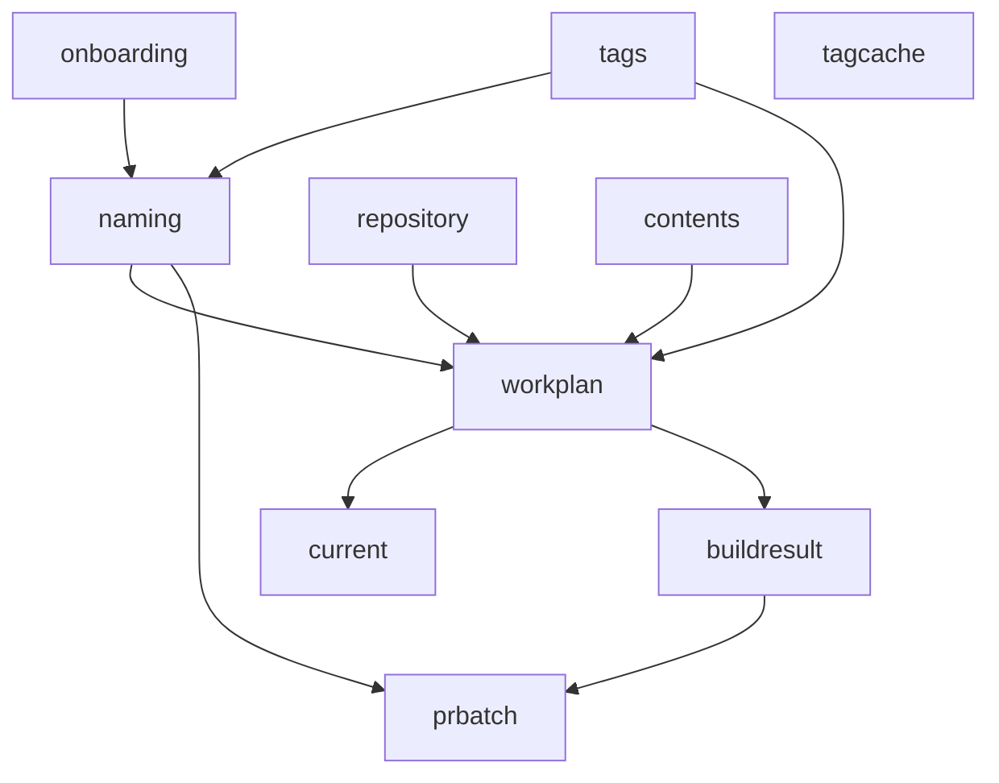

# Architecture — Domain Struct Workflow

This document describes how data flows through the domain types across the three
pipeline phases. Every struct lives under [domain/](domain/) and has a single,
focused package.

## Pipeline Phases

```bash
Phase 1  Resolve   ()                              → workplan.WorkPlan
Phase 2  Generate  workplan.WorkPlan               → []buildresult.BuildResult
Phase 3  Publish   []buildresult.BuildResult       → []prbatch.PRBatch → []PublishOutcome
```

Wiring lives in [main.go](main.go); orchestration entry points are in
[workflow/orchestration/](workflow/orchestration/).

## Domain Packages

| Package | Purpose | Key Types |
|---|---|---|
| [domain/onboarding](domain/onboarding/) | YAML schema of partner `onboard.yml` files | `OnboardFile`, `ComponentConfig` |
| [domain/tags](domain/tags/) | Tag pattern matching and resolved tag data | `Patterns`, `Set` |
| [domain/naming](domain/naming/) | Identity + derived names for a component+tag | `Naming` |
| [domain/repository](domain/repository/) | Source repo metadata + generator detection | `RepoInfo`, `SourceGenerator` |
| [domain/contents](domain/contents/) | Parsed Dockerfile/Makefile + spec model | `DockerfileInfo`, `MakefileInfo`, `DockerSpec`, `BuildTarget` |
| [domain/workplan](domain/workplan/) | Unit of work for the pipeline | `WorkItem`, `WorkPlan`, `Sources` |
| [domain/current](domain/current/) | Pointer to the in-flight `WorkItem` | `Item *workplan.WorkItem` |
| [domain/tagcache](domain/tagcache/) | Global repo → tag → SHA cache | `Cache`, `Init`, `Lookup` |
| [domain/buildresult](domain/buildresult/) | Phase 2 per-item output | `BuildResult`, `Outcome` |
| [domain/prbatch](domain/prbatch/) | Phase 3 PR grouping | `PRGroupKey`, `BatchComponent`, `PRBatch` |

## Dependency Graph



All edges point from leaf data toward composite types. No cycles.

## Struct Workflow by Phase

### Phase 1 — Resolve

Input: an `onboard.yml` path.
Output: `workplan.WorkPlan{Items, ExistingPaths}`.

Steps and structs produced:

1. **Parse onboard files** → `onboarding.OnboardFile` (auto-detects standalone
   components vs groups, validates `Targets`).
2. **Walk each `onboarding.ComponentConfig`** → seed a `naming.Naming` with the
   embedded YAML fields plus runtime values (`OnboardDir`, `SpecImageName`,
   `SpecRepository`, `GroupName`).
3. **Fetch and cache tags** for each `Repository` → populate
   `tagcache.Cache[repoURL][tag] = commitSHA`.
4. **Match `tags.Patterns` against repo tags** → one `tags.Set` per actionable
   tag (`Full`, `Stripped`, `Version`, `Revision`).
5. **Call `Naming.Construct(tagSet)`** → fills `DisplayName`, `VersionRevision`,
   `FolderPath`, `SpecFilePath`. `BranchName` / `PRTitle` stay empty until a
   PRID is assigned in Phase 3.
6. **Emit one `workplan.WorkItem`** per `(Naming, tags.Set)`. Phase 2 will
   populate the remaining fields.
7. **Wrap items + existing remote paths** into `workplan.WorkPlan`.

### Phase 2 — Generate

Input: `workplan.WorkPlan`.
Output: `[]buildresult.BuildResult` (one per item; never nil).

For each `workplan.WorkItem`, orchestration sets
`current.Item = &item` and runs:

1. **Discover sources** — fetch Dockerfile and Makefile from the partner repo
   at `Tag.Full`, store in `workplan.Sources` on the item. Compute
   `ContentChanged` by diffing against the previous spec's siblings.
2. **Resolve action** — using `ExistingPaths`, `ContentChanged`, and revision
   data, pick one of: `Skipped`, `BumpRevision`, `BumpVersion`, `Generated`.
3. **Populate derived fields** on `current.Item`:
   - `RepoInfo *repository.RepoInfo` — owner/repo/branch/license/Go version,
     looked up via `tagcache.Lookup(repoURL, Tag.Full)`.
   - `Dockerfile contents.DockerfileInfo` and `Makefile contents.MakefileInfo`
     — produced by the parser.
   - `Spec *contents.DockerSpec` — `Binaries`, `PipelineSteps`, `Entrypoint`,
     `Symlink` extracted statically from the Dockerfile.
4. **Run the chosen action** — bump-revision / bump-version copy the template
   with new commit + revision; generate runs the full transformer chain over
   the populated `current.Item` to produce a fresh spec YAML.
5. **Wrap the output** in a `buildresult.BuildResult{Item, Outcome, SpecContent, Err}`.
   `IsPublishable()` is true for `BumpVersion`, `BumpRevision`, `Generated`.

### Phase 3 — Publish

Input: `[]buildresult.BuildResult`.
Output: `[]prbatch.PRBatch` → `[]PublishOutcome`.

1. **Group results** by `prbatch.PRGroupKey{GroupName, Tag.Stripped}`. Each
   group becomes one `prbatch.PRBatch` with a fresh `PRID` from
   `naming.GeneratePRID()`.
2. **Resolve batch naming** — for every `prbatch.BatchComponent`, call
   `result.Item.Naming.WithPRID(batch.PRID)` to fill `BranchName` and
   `PRTitle`. The result is a new `Naming` stored on the `BatchComponent`.
3. **Publish each batch** — commit spec files and open one PR per
   `prbatch.PRBatch` against the spec repo, returning a `PublishOutcome`.

## The `Naming` Struct in Detail

`naming.Naming` is the spine of the pipeline. It has three explicit sections:

| Section | Source | When populated |
|---|---|---|
| Embedded `onboarding.ComponentConfig` | YAML | Phase 1 parse |
| Runtime (`OnboardDir`, `SpecImageName`, `SpecRepository`, `GroupName`) | Walk of `OnboardFile` | Phase 1 per-component |
| Generated (`DisplayName`, `VersionRevision`, `FolderPath`, `SpecFilePath`) | `Construct(tagSet)` | Phase 1 after tag resolution |
| Generated (`BranchName`, `PRTitle`) | `WithPRID(prID)` | Phase 3 after PRID assignment |

This split keeps the contract clear: callers know exactly which fields are safe
to read in each phase.

## Global State

Two globals are used so deep call stacks do not have to thread the active item:

- `current.Item *workplan.WorkItem` — set at the top of every iteration in
  Phase 2 / Phase 3; transformer, parser, and infrastructure layers read from it.
- `tagcache.Cache map[string]map[string]string` — populated once in Phase 1
  via `tagcache.Init()`, then read by `tagcache.Lookup()` from later phases.

Everything else flows through explicit function arguments and return values.
